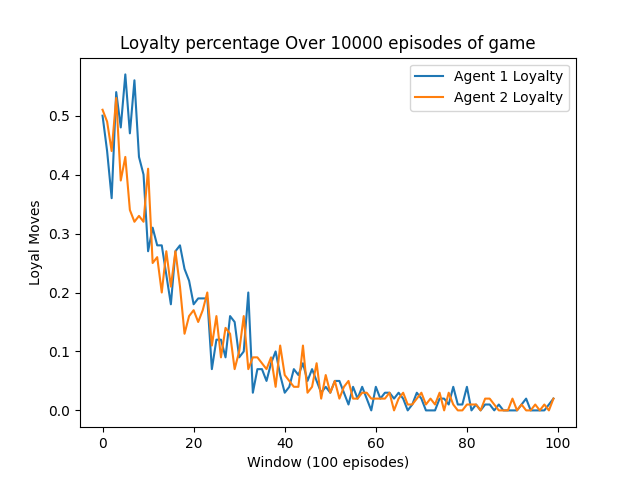
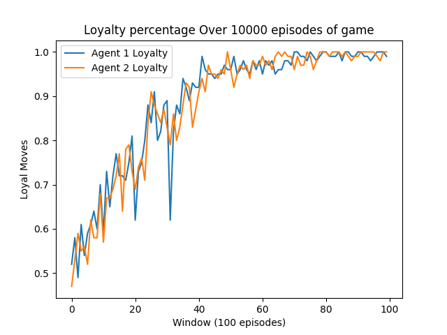

# Q-Learning

Q-learning is a model free reinforcement learning algorithm.
The agent learns the quality of taking action $a$ in state $s$, which is called $Q(s, a)$

$Q$ values are to be updated using Bellman equation:

```math
Q(s, a) \leftarrow Q(s, a) + \alpha \Big[r + \gamma\, \mathrm{max}Q(s^\prime, a^\prime)  -  Q(s, a)\Big]
```

- $s$ is the current state
- $a$ action taken
- $r$ is the reward received
- $s^\prime$ is the next state
- $lr$ is the learning rate
- $\gamma$ is the discount factor (how importat future rewards are)

If prisoners are pure bandits they do not care about the future rewards. They want immediate advantage. i.e., $\gamma=0$

In python
```python
def update_q(Q, s, a, r, s_next, alpha, gamma):
    best_next = torch.max(Q[s_next])
    Q[s, a] = (1 - alpha) * Q[s, a] + alpha * (r + gamma * best_next)
```

# Greedy Policy
The agents must exploit the best known action but should be curious enough to explore other options. In this way, the agents will not lock in on one path and explore other options too!
```python
def epsilon_greedy(Q, state_idx, epsilon):
    if torch.rand(1).item() < epsilon:
        return torch.randint(action_size, (1,)).item()
    return torch.argmax(Q[state_idx]).item()
```

# Game Economics
| Agent 1 / 2       | **R, R**                                  | **R, L**                                    | **L, R**                                 | **L, L**                                |
| ------------------ | ----------------------------------------- | ------------------------------------------- | ---------------------------------------- | --------------------------------------- |
| **Model 1**   | (1, 1) — both betray <br> *low payoff*    | (5, 0) — betray loyal <br> *max reward*     | (0, 5) — betrayed <br> *worst case*      | (3, 3) — both loyal <br> *mutual trust* |
| **Model 2** | (-10, -10) — both betray <br> *huge loss* | (0, -5) — betray loyal <br> *selfish win* | (-5, 0) — betrayed <br> *major penalty* | (0, 0) — both loyal <br> *no gain/loss* |

If your goal is to catch both bandits (i.e., get them to betray each other), then offering a better deal for betrayal works well. In other words, to catch both, you must make betrayal tempting. Here, Model 1 is a tempting offer, while in Model 2, there is no personal dilemma at al. Because:
- If agent 2 decides for R: agent 1 gets either –10 or -5 no matter what they do.
- If agent 2 decides for L: agent 2 gets 0 no matter what they do.

leading to the situation where agent 1 is indifferent between R and L in every circumstance. Model 1 is, on the other hand, a real dilemma. 
they can be coded 
```python
    def game_rewards(self, agent_1_action, agent_2_action):
        """
        For each round both agents need to decide
        and eigher get rewarded or punished.
        R --> ratting out your partner
        L --> stay loyal to your partner 
        """

        actions = {
            ('R', 'R'): (1, 1), # being a rat costs but not as high as being loyal
            ('R', 'L'): (5, 0), # reward being a rat
            ('L', 'R'): (0, 5), # reward being a rat
            ('L', 'L'): (3, 3), # being loyal is costly
        }

        return actions[(agent_1_action, agent_2_action)]
```
and 
```python
    def game_rewards(self, agent_1_action, agent_2_action):
        """
        For each round both agents need to decide
        and eigher get rewarded or punished.
        R --> ratting out your partner
        L --> stay loyal to your partner 
        """

        actions = {
            ('R', 'R'): (-10, -10),
            ('R', 'L'): (0, -5),
            ('L', 'R'): (-5, 0),
            ('L', 'L'): (0, 0),
        }

        return actions[(agent_1_action, agent_2_action)]
```
Model 1 leading to 



while model 2




